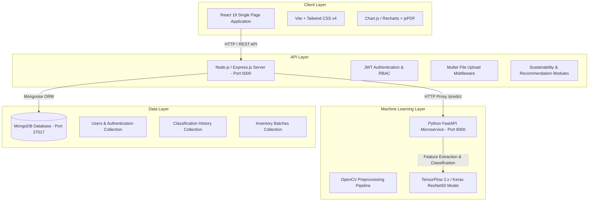

# AI Textile Waste Intelligence Platform

An enterprise-grade, full-stack Artificial Intelligence platform designed to automate textile waste material classification, fabric blend recognition, recyclability assessment, sustainability impact calculations, and circular economy inventory management.

---

## 📌 Project Overview

The **AI Textile Waste Intelligence Platform** bridges computer vision machine learning with industrial sustainability workflows. By analyzing digital images of textile waste, the platform automatically identifies material types (Cotton, Polyester, Wool, Silk, Linen, Denim, Nylon, Rayon, Acrylic, Mixed Fabrics), calculates confidence scores, evaluates recyclability potential, estimates environmental savings (CO₂ offsets, water savings, landfill diversion), and recommends optimal end-of-life recycling pathways.

### Target Audience & Stakeholders
- **Textile Recycling Facilities**: Streamline sort-line operations, material purity categorization, and throughput tracking.
- **Garment Manufacturers**: Measure post-industrial cutting waste, calculate recycled fiber substitution rates, and displacement of virgin materials.
- **Sustainability Managers & ESG Auditors**: Monitor carbon footprint reductions, freshwater preservation, landfill diversion, and ESG compliance.
- **Platform Administrators**: Oversee platform health, system metrics, model performance, and user activity.

---

## ⭐ Key Highlights

- **AI-Powered Textile Image Analysis**: Automated visual classification of textile materials from digital images.
- **Material & Fabric Classification**: Detects 10 major fabric types (Cotton, Polyester, Wool, Silk, Linen, Denim, Nylon, Rayon, Acrylic, Mixed Fabrics).
- **Recyclability & Waste Intelligence**: Evaluates purity grades and calculates recyclability scores (0–100/100).
- **Sustainability Impact Calculation**: Quantifies greenhouse gas (CO₂) offsets, freshwater savings (liters), and municipal solid waste diversion (kg).
- **Circularity & Sustainability Scoring**: Generates composite eco-scores to guide end-of-life management.
- **Recycling & Reuse Recommendations**: Recommends optimal pathways (Mechanical Recycling, Chemical Recycling, Upcycling, Industrial Resale).
- **Textile Inventory Management**: Centralized batch ledger for tracking post-industrial and post-consumer textile shipments.
- **Classification History**: Searchable, filterable archive of past predictions with detailed analysis reports.
- **Multi-Role Enterprise Dashboards**: Tailored dashboard views for Sustainability Managers, Recycling Facilities, Manufacturers, and Administrators.
- **Real-Time Toast Notifications**: Interactive system alerts for processing status, inventory changes, and data updates.
- **Reports & PDF Export**: Dynamic client-side rendering and export of analytical reports via `jsPDF`.
- **Secure Authentication & RBAC**: JWT-based authentication with bcrypt password hashing and role-based access control.

---

## 🎯 Problem Statement

The global fashion and textile industry generates over 92 million tons of textile waste annually. A major operational bottleneck in circular textile management is the manual, error-prone sorting of mixed post-consumer garments and post-industrial fabric scraps. Unidentified material blends lead to contaminated recycling streams, downcycling, or unnecessary incineration and landfilling.

---

## 🏆 Objectives

1. **Automate Material Identification**: Replace manual visual inspection with computer vision deep learning inference.
2. **Standardize Recyclability Assessment**: Provide deterministic scoring and purity thresholds for recycling readiness.
3. **Quantify Environmental Impact**: Calculate verifiable metrics for carbon offset, water preservation, and waste diversion.
4. **Digitize Waste Inventory**: Establish a central ledger linking physical fabric batches to digital intelligence records.
5. **Empower Industry Decision-Making**: Deliver role-specific analytics to mills, recyclers, and sustainability executives.

---

## 💡 Solution

The AI Textile Waste Intelligence Platform combines a **React 19** single-page web application, a robust **Node.js/Express** REST API, a specialized **Python FastAPI** deep learning microservice, and a **MongoDB** document database. High-resolution fabric images are preprocessed and analyzed by a TensorFlow/Keras convolutional neural network to extract deep material features, feed the sustainability engine, and update the inventory ledger in real time.

---

## 🚀 Core Features

### 1. Authentication & Role-Based Access
Secure user registration and login utilizing JSON Web Tokens (JWT) and `bcryptjs` password hashing. Grants permission-based access according to user roles (*Admin*, *Sustainability Manager*, *Recycling Facility*, *Manufacturer*).

### 2. Textile Image Analysis
Interactive drag-and-drop image uploader supporting `JPG`, `PNG`, and `WEBP` image formats with real-time file validation, image preview, and upload progress feedback.

### 3. AI Material Classification
Deep learning model inference returning the primary predicted material, percentage confidence score, and top-5 class probability breakdown.

### 4. Recyclability & Waste Intelligence
Evaluates fabric purity and structural composition to assign a color-coded recyclability grade (*Green*, *Yellow*, *Orange*, *Red*) and a numerical score out of 100.

### 5. Sustainability Intelligence
Automated calculation of environmental benefits derived from diverting fabric batches from landfills into closed-loop recycling.

### 6. Environmental Impact Assessment
Computes specific metrics for:
- **CO₂ Offset (kg CO₂e)**: Avoided emissions compared to virgin fabric production.
- **Water Savings (Liters)**: Preservation of freshwater resources based on material type.
- **Landfill Diversion (kg)**: Solid waste mass kept out of municipal landfills.

### 7. Circularity Scoring
Generates a consolidated Sustainability & Circularity Score combining material purity, condition, recyclability grade, and environmental offset.

### 8. Recycling / Reuse Recommendations
Suggests optimal circular pathways:
- **Mechanical Recycling**: For high-purity mono-materials (e.g., 100% Cotton, 100% Wool).
- **Chemical Recycling**: For complex synthetic or blended fabrics (e.g., Polyester-Cotton blends).
- **Upcycling / Resale**: For high-quality, undamaged textile items.
- **Industrial Wiping / Downcycling**: Fallback pathway for contaminated or low-purity fabrics.

### 9. Textile Inventory Management
Full CRUD batch ledger interface to log, track, filter, search, update, and remove textile waste batches with weight (kg), material composition, supplier, and status.

### 10. Analysis History
Historical database archive listing past image predictions with search bar filtering by material name, filename, or waste category. Includes single-click record deletion and report viewing.

### 11. Dashboards & Analytics
Role-tailored dashboards featuring Chart.js visual visualizations:
- **Executive Overview (`/dashboard`)**: Aggregated platform metrics and eco-impact summary.
- **Sustainability Manager (`/dashboard/sustainability`)**: Carbon footprint, water preservation, and ESG tracking.
- **Recycling Facility (`/dashboard/recycling`)**: Sort-line throughput, material purity distribution, and stream breakdown.
- **Manufacturer (`/dashboard/manufacturer`)**: Recycled fiber substitution rate and virgin material displacement.
- **Admin (`/dashboard/admin`)**: System health, API throughput, model inference metrics, and user management.

### 12. Notifications
Global notification context delivering toast feedback alerts for API operations, deletion confirmations, and validation messages.

### 13. Reports & Export
Dedicated report view (`/report/:id`) displaying full diagnostic breakdowns, preprocessing metadata, and automated PDF export functionality powered by `jsPDF`.

### 14. User Profile Management
Personalized user profile interface (`/profile`) allowing users to view account details, verify assigned organization roles, and update profile metadata.

---

## 🧬 AI / ML Pipeline

```
  [ Image Upload ] ──> [ React 19 Client ] ──> [ Express API Proxy ] ──> [ FastAPI Microservice ]
                                                                                   │
  [ Classification Result ] <── [ Sustainability Engine ] <── [ ResNet50 Inference ] <── [ OpenCV Preprocessing ]
```

1. **Image Upload**: User uploads a fabric sample image via the frontend interface.
2. **Preprocessing**: The Python service loads the image, resizes it to $224 \times 224 \times 3$, normalizes pixel values to $[0.0, 1.0]$, and applies bilateral noise filtering.
3. **Feature Extraction & Inference**: A fine-tuned **ResNet50** Convolutional Neural Network extracts spatial visual features and generates softmax probability distributions over 10 material classes.
4. **Classification & Recyclability**: The model identifies the top material class and maps confidence metrics to recyclability grades.
5. **Sustainability Calculation**: The backend sustainability module applies material-specific conversion factors to calculate CO₂ savings, water preservation, and landfill diversion.
6. **Recommendation & Output**: The platform evaluates the optimal circular pathway and returns a structured JSON payload to render the UI prediction card and store the analysis record in MongoDB.

---

## 🌿 Sustainability Intelligence

The platform computes environmental savings based on material composition and batch weight:

| Material Type | CO₂ Offset (kg CO₂/kg) | Water Savings (Liters/kg) | Landfill Diversion (kg/kg) |
| :--- | :---: | :---: | :---: |
| **Cotton** | $2.10$ | $9,750$ | $1.00$ |
| **Polyester** | $4.20$ | $1,250$ | $1.00$ |
| **Wool** | $5.40$ | $3,500$ | $1.00$ |
| **Silk** | $6.10$ | $4,200$ | $1.00$ |
| **Linen** | $1.80$ | $4,100$ | $1.00$ |
| **Denim** | $2.50$ | $9,000$ | $1.00$ |
| **Nylon** | $4.80$ | $1,600$ | $1.00$ |
| **Rayon** | $2.90$ | $2,800$ | $1.00$ |
| **Acrylic** | $4.50$ | $1,400$ | $1.00$ |
| **Mixed Fabrics** | $2.30$ | $3,200$ | $1.00$ |

*Note: Metrics represent estimates calculated using implemented platform domain methodology.*

---

## 👥 User Roles & Access Matrix

| Role | Access Permissions & Key Capabilities |
| :--- | :--- |
| **Admin** | Full system access, platform analytics, model health diagnostics, total API call logs, user account monitoring. |
| **Sustainability Manager** | Carbon offset tracking, freshwater preservation reporting, ESG compliance dashboards, history archive. |
| **Recycling Facility** | Sort-line throughput metrics, purity distribution analysis, batch recyclability grading, inventory ledger CRUD. |
| **Manufacturer** | Virgin material displacement metrics, recycled fiber substitution rates, batch inventory tracking, image analysis. |

---

## 🏗️ System Architecture



---

## 🛠️ Technology Stack

### Frontend
- **Framework**: React 19 (`react`, `react-dom`)
- **Build Tool**: Vite v8
- **Styling**: Tailwind CSS v4 (`@tailwindcss/vite`), Custom Vanilla CSS
- **Typography**: Inter & Poppins (Google Fonts)
- **State & Routing**: React Router v7 (`react-router-dom`), React Context API
- **Data Visualization**: Chart.js (`chart.js`, `react-chartjs-2`)
- **PDF Generation**: `jspdf`, `jspdf-autotable`
- **HTTP Client**: Axios

### Backend API
- **Runtime**: Node.js (v18+)
- **Framework**: Express.js (v5)
- **Database Connector**: Mongoose (v9)
- **Authentication**: JSON Web Tokens (`jsonwebtoken`), Password Hashing (`bcryptjs`)
- **File Uploads**: Multer
- **Validation**: Validator.js, Dotenv

### AI / Machine Learning
- **Language**: Python 3.10+
- **API Framework**: FastAPI, Uvicorn
- **Deep Learning Framework**: TensorFlow 2.x, Keras
- **Image Processing**: OpenCV (`opencv-python`), Pillow (`PIL`)
- **Scientific Computing**: NumPy, Scikit-Learn

### Database
- **Engine**: MongoDB (v6.0+ / Local or Atlas)
- **Object Modeling**: Mongoose ORM

---

## 📁 Project Structure

```
AI_Textile_Waste_Intelligence_Platform/
├── backend/                        # Node.js + Express REST API Server
│   ├── config/                     # Database connection configuration (db.js)
│   ├── controllers/                # Auth, Analysis, Classification controllers
│   ├── middleware/                 # JWT Auth & Error Handling middleware
│   ├── models/                     # Mongoose schemas (User, Inventory, Analysis)
│   ├── recommendation/             # Recycling Recommendation Engine
│   ├── sustainability/             # Sustainability Intelligence Engine
│   ├── routes/                     # API routing (/api/auth, /api/analysis, etc.)
│   ├── scripts/                    # Image preprocessing & DB test utilities
│   ├── uploads/                    # Temporary image upload directory
│   ├── package.json                # Backend dependencies
│   └── server.js                   # Node.js server entry point
├── frontend/                       # React 19 Single-Page Web Client
│   ├── src/
│   │   ├── Analysis/               # ImageAnalysisPage, AnalysisReport, HistoryPage
│   │   ├── Authentication/         # Login, Register, Profile, AuthContext, ProtectedRoute
│   │   ├── Dashboard/              # Overview, Admin, Sustainability, Recycling, Manufacturer Dashboards
│   │   ├── Home/                   # Landing Page
│   │   ├── Inventory/              # Inventory Ledger Dashboard & Modal
│   │   ├── Shared/                 # Navbar, Footer, ErrorBoundary, Axios instance
│   │   ├── main.jsx                # React application mount
│   │   └── index.css               # Design system tokens & global CSS
│   ├── index.html                  # HTML template with Google Fonts
│   ├── package.json                # Frontend dependencies
│   └── vite.config.js              # Vite bundler configuration
├── ml_model/                       # Python AI / ML Microservice
│   ├── class_labels.json           # Index-to-material label mapping
│   ├── main.py                     # FastAPI microservice server
│   ├── predictor.py                # Model inference handler
│   ├── preprocessing.py            # Image cleaning & tensor transformation
│   ├── train.py                    # Transfer learning model trainer
│   ├── requirements.txt            # Python ML dependencies
│   └── model.keras                 # Trained ResNet50 TensorFlow model
├── models/                         # Saved Model Artifacts
│   ├── textile_model.keras         # Textile classification model
│   ├── waste_model.keras           # Recyclability waste model
│   ├── class_labels.json           # Material label mapping
│   └── prediction_config.json      # Model input configuration
├── dataset/                        # AITEX Dataset & Image Storage
├── docs/                           # Documentation & Evaluation Reports
├── notebooks/                      # Jupyter EDA Notebooks
├── reports/                        # Model Evaluation Metric Artifacts
├── package.json                    # Workspace configuration
└── README.md                       # Project documentation
```

---

## ⚡ Installation & Setup Guide

### 1. Prerequisites
- **Node.js**: v18.0.0 or higher
- **Python**: v3.10.0 or higher
- **MongoDB**: Community Server running on `mongodb://127.0.0.1:27017` (or MongoDB Atlas URI)

### 2. Clone Repository
```bash
git clone https://github.com/sailokesh365/AI-Textile-Waste-Intelligence-Platform.git
cd AI-Textile-Waste-Intelligence-Platform
```

### 3. Setup ML Microservice (Python)
```bash
# Create and activate Python virtual environment
python -m venv .venv

# On Windows (PowerShell):
.venv\Scripts\activate

# On Linux / macOS:
source .venv/bin/activate

# Install Python requirements
pip install -r ml_model/requirements.txt
```

### 4. Setup Backend API (Node.js)
```bash
cd backend
npm install
```

### 5. Setup Frontend Web Client (React)
```bash
cd ../frontend
npm install
```

---

## 🔑 Environment Variables

Create a `.env` file in the `backend/` directory:

```env
# Backend Server Port
PORT=5000

# MongoDB Connection String
MONGO_URI=mongodb://127.0.0.1:27017/textile_intel

# JWT Authentication Secret
JWT_SECRET=super_secret_jwt_key_textile_intelligence_2026

# FastAPI Microservice URL
FASTAPI_URL=http://127.0.0.1:8000
```

---

## 🚦 Running the Application

Open 3 separate terminal instances:

### Terminal 1: Python FastAPI ML Service (Port 8000)
```bash
cd ml_model
uvicorn main:app --host 127.0.0.1 --port 8000 --reload
```

### Terminal 2: Node.js Express Backend (Port 5000)
```bash
cd backend
npm start
```

### Terminal 3: React Frontend Client (Port 5173 / 5174)
```bash
cd frontend
npm run dev
```

Open your web browser and navigate to `http://localhost:5173` (or `http://localhost:5174`).

---

## 🔄 Application Workflow

```
[ Register / Login ] ──> [ Platform Landing Page ]
                                │
                    [ AI Image Analysis Page ]
                                │
                    [ Drag & Drop Fabric Image ]
                                │
                    [ View Classification & Recyclability ]
                                │
           ┌────────────────────┴────────────────────┐
           ▼                                         ▼
[ Save Record to History ]                 [ Log Batch in Inventory ]
           │                                         │
           └────────────────────┬────────────────────┘
                                ▼
                   [ View Analytics Dashboard ]
                                │
                   [ Export Detailed PDF Report ]
```

---

## 📡 API Overview

### Authentication (`/api/auth`)
- `POST /api/auth/register` - User account creation.
- `POST /api/auth/login` - User login & JWT issuance.
- `GET /api/auth/profile` - Authenticated user profile.
- `PUT /api/auth/profile` - Profile updates.

### AI Material Analysis & History (`/api/analysis` & `/api/history`)
- `POST /api/analysis/classify` - Upload image, perform AI classification, save record.
- `GET /api/analysis/history` - Fetch classification history for logged-in user.
- `GET /api/analysis/:id` - Fetch single analysis record by ID.
- `DELETE /api/analysis/:id` - Delete single analysis record.
- `GET /api/analysis/dashboard-stats` - Retrieve platform aggregate stats.

### Inventory Ledger (`/api/inventory`)
- `POST /api/inventory` - Create new textile waste batch.
- `GET /api/inventory` - List inventory batches with search & filters.
- `GET /api/inventory/:id` - Get inventory batch details.
- `PUT /api/inventory/:id` - Update inventory batch.
- `DELETE /api/inventory/:id` - Delete inventory batch.

### Sustainability & Recommendations (`/api/sustainability` & `/api/recommendation`)
- `POST /api/sustainability/analyze` - Calculate environmental impact metrics.
- `POST /api/recommendation/evaluate` - Evaluate recycling/reuse pathway.
- `GET /api/health` - Backend and database health check.

---

## 📊 AI Model & Dataset Information

- **Dataset**: AITEX Textile Defect & Weave Database (10 Mapped Material Classes).
- **Preprocessing**: OpenCV resizing ($224 \times 224 \times 3$), Min-Max normalization $[0.0, 1.0]$, noise filtering, and data augmentation.
- **Model Architecture**: ResNet50 Transfer Learning fine-tuned with custom classification heads.
- **Classes**: Cotton, Polyester, Wool, Silk, Linen, Denim, Nylon, Rayon, Acrylic, Mixed Fabrics.
- **Inference Speed**: $< 150\text{ ms}$ per sample image.

---

## 🧪 Testing & Verification

The codebase has undergone full pre-git verification:
- **Frontend Production Build**: `PASSED` (`npm run build` executed with 0 errors).
- **Backend Service**: `VERIFIED` (Express server running on port 5000 with MongoDB connected).
- **AI Microservice**: `VERIFIED` (FastAPI running on port 8000 with TensorFlow inference active).
- **End-to-End Workflows**: User authentication, image classification, history tracking, inventory CRUD, dashboard rendering, and PDF report export verified.

---

## 🔒 Security Measures

- **JWT Authentication**: Secure token verification on protected API routes.
- **Password Protection**: Salting and hashing via `bcryptjs`.
- **RBAC**: Role-based routing on frontend and authorization middleware on backend.
- **Environment Isolation**: Secrets stored in environment variables (`.env`) excluded from Git version control.

---

## 📊 Current Project Status

- **Core Application Functionality**: `COMPLETED` ✅
- **Frontend Build**: `PASSED` ✅
- **Backend API**: `VERIFIED` ✅
- **ML Service**: `VERIFIED` ✅
- **Database**: `VERIFIED` ✅
- **Core User Workflows**: `VERIFIED` ✅
- **Production Cloud Deployment**: `PENDING`
- **Docker Containerization**: `PENDING`

---

## 🖼️ Application Screenshots & Interface

| View | Description |
| :--- | :--- |
| **Home Landing Page** | Overview of platform features, hero banner with Poppins typography, and quick metrics. |
| **Authentication** | Login and Registration pages with JWT validation. |
| **Image Analysis Page** | Drag-and-drop file uploader, AI inference trigger, and preprocessed preview. |
| **AI Result & Report** | Material classification card, confidence breakdown, recyclability score, and PDF export. |
| **Classification History** | Compact SaaS data table with search, category filtering, and record management. |
| **Inventory Ledger** | Batch inventory table with batch registration modal and status management. |
| **Analytics Dashboards** | Role-tailored dashboards (Executive, Sustainability, Recycling, Manufacturer, Admin) with Chart.js analytics. |
| **User Profile** | Account overview and role management page. |

---

## 🔮 Future Enhancements

- **NIR Spectroscopy Integration**: Combine RGB computer vision with Near-Infrared sensor inputs for blended fiber quantification.
- **Edge Model Optimization**: Quantize models to TensorFlow Lite (TFLite) / ONNX for handheld mobile sorting scanners.
- **Production Dockerization**: Package Frontend, Express API, FastAPI, and MongoDB into a single `docker-compose` stack.
- **Cloud Hosting Deployment**: Deploy backend microservices to AWS / GCP / Vercel.

---

## 👥 Contributors

- **Author**: Sai Lokesh Reddy Pannala
  - *B.Tech – Information Technology*
  - *ACE Engineering College*
  - *Infosys Springboard Internship Project*

---

## 📜 License

This project is licensed under the **MIT License**.

---

## ⚠️ Disclaimer

Environmental metrics (CO₂ offsets, water savings, landfill diversion) are estimates derived from standard textile industry Life Cycle Assessment (LCA) conversion factors applied within the platform's calculation engine.
