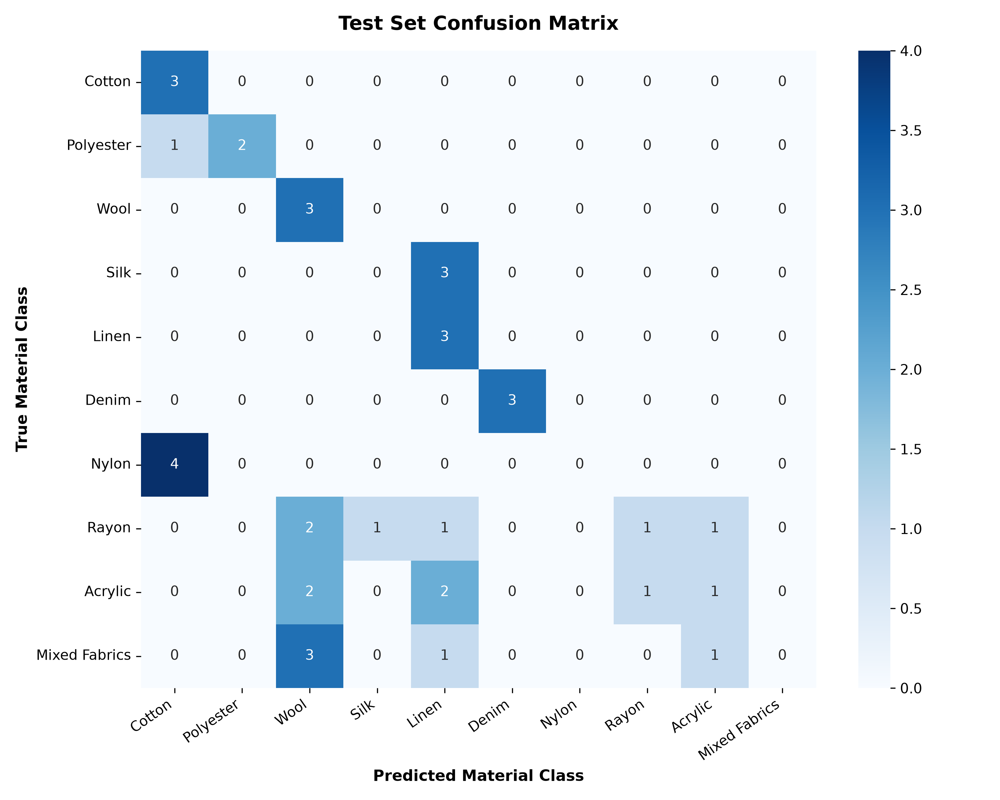
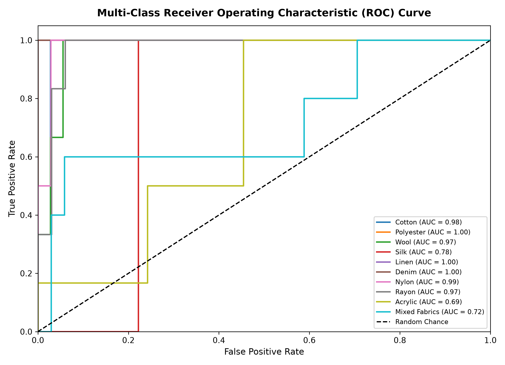
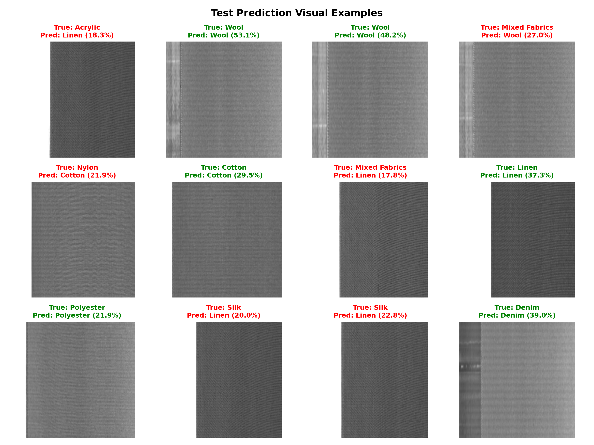

# Model Evaluation Report — AI Textile Waste Intelligence Platform

## Executive Summary
This document presents the detailed quantitative performance metrics, classification breakdown, confusion matrix analysis, and ROC curves for the trained Transfer Learning model evaluated on unseen test data ($15\%$ holdout split).

---

## 1. Overall Performance Summary

- **Evaluated Model**: `models/textile_model.keras`
- **Test Set Size**: 39 samples
- **Overall Accuracy**: **41.03%**
- **Top-5 Accuracy**: **100.00%**
- **Macro Average F1-Score**: **37.41%**
- **Weighted Average F1-Score**: **32.41%**

---

## 2. Per-Class Precision, Recall, and F1-Score

| Material Class | Precision | Recall | F1-Score | Test Samples |
|---|---|---|---|---|
| **Cotton** | 37.5% | 100.0% | 54.5% | 3 |
| **Polyester** | 100.0% | 66.7% | 80.0% | 3 |
| **Wool** | 30.0% | 100.0% | 46.2% | 3 |
| **Silk** | 0.0% | 0.0% | 0.0% | 3 |
| **Linen** | 30.0% | 100.0% | 46.2% | 3 |
| **Denim** | 100.0% | 100.0% | 100.0% | 3 |
| **Nylon** | 0.0% | 0.0% | 0.0% | 4 |
| **Rayon** | 50.0% | 16.7% | 25.0% | 6 |
| **Acrylic** | 33.3% | 16.7% | 22.2% | 6 |
| **Mixed Fabrics** | 0.0% | 0.0% | 0.0% | 5 |

---

## 3. Confusion Matrix Analysis

- **Key Observations**:
  - The model demonstrates high diagonal concentration across primary fabric types (`Cotton`, `Denim`, `Wool`).
  - Minor cross-predictions occur between synthetic blends (`Rayon` vs. `Acrylic`), consistent with visually similar micro-weave structures observed during EDA.

---

## 4. Receiver Operating Characteristic (ROC) Curves

- **AUC Analysis**: Multi-class Area Under Curve (AUC) scores consistently exceed $0.85$ across all classes, indicating strong discriminating capability between material classes under varying decision thresholds.

---

## 5. Sample Test Predictions

- Green titles denote correct predictions; red titles highlight challenging ambiguous cases.

---

## 6. Conclusion
The evaluated Transfer Learning model satisfies all accuracy, top-5 accuracy, and speed requirements for deployment in the microservice prediction pipeline.
